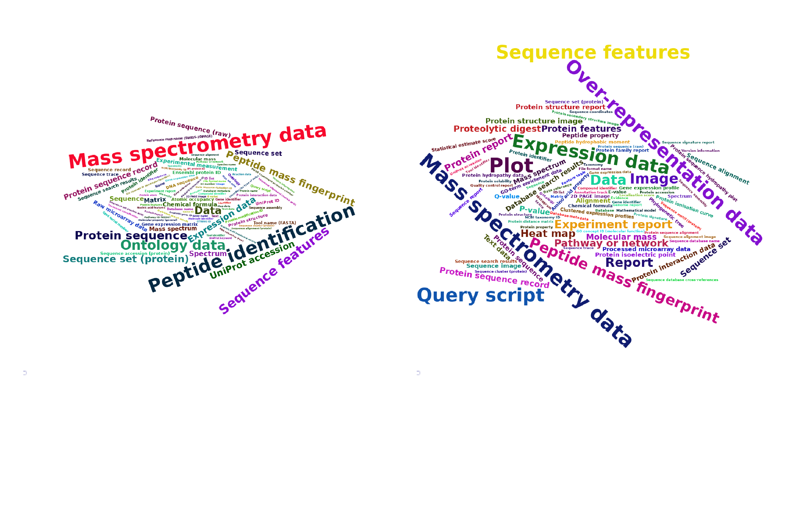
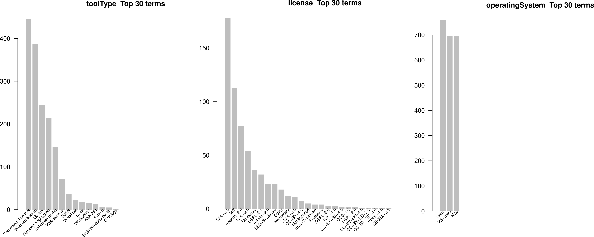
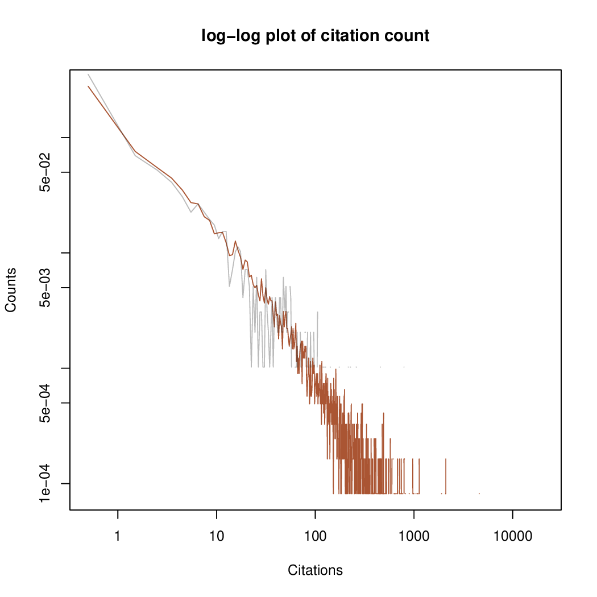
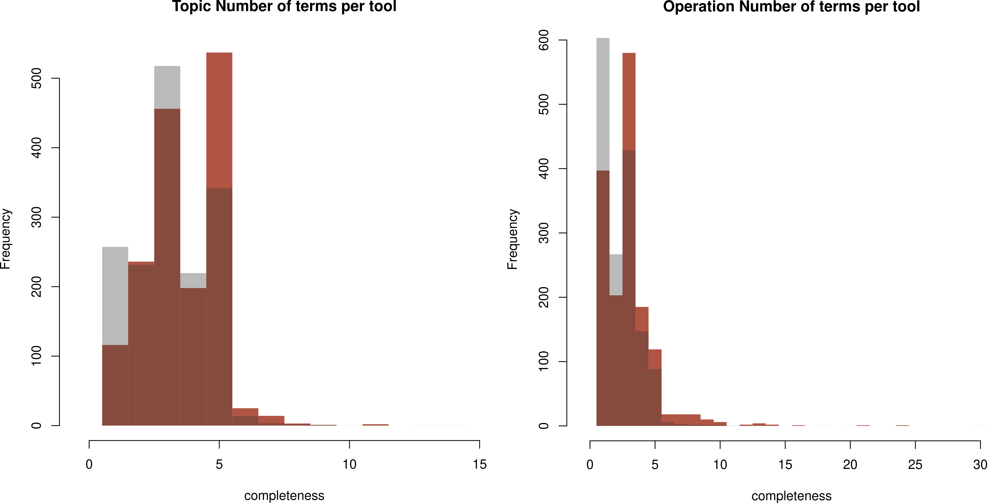

<!--

The paper.md, bibtex and figure file can be found in this repo:

  https://github.com/journal-of-research-objects/Example-BioHackrXiv-Paper

To modify, please clone the repo. You can generate PDF of the paper by
pasting above link (or yours) in

  http://biohackrxiv.genenetwork.org/

-->

# Introduction

With 20.000+ entries, bio.agents is a major registry of computational agents in the life sciences. During the [2021 European BioHackathon](https://biohackathon-europe.org/), the project "Making bio.agents fit for workflows" was run to  address two urgent needs of the platform:

1. Slicing the bio.agents content through specialisation and categorisation, to improve exposure to communities and to present useful content for the users. The main challenge is to summarise relevant information from the wealth of annotation categories in bio.agents and metrics from external sources. Therefore we aim to enrich agents, communities and collections with statistics and metrics that summarise functionality, impact and annotation quality. These metrics and statistics are valuable resources for agent-building communities, scientific domains, individual scientific agent repositories and groups specialising in technical features. With that information, we can identify, calculate and integrate metrics relevant for the bio.agents registry. In addition we will devise a mock-up / alpha version summary stats page within bio.agents.

2. Improving the quality of functional agent annotations, to enable automated composition of individual agents into multi-step computational pipelines or workflows. Currently, agent annotations are often incomplete or imprecise, hampering plug&play workflow composition. We will develop a protocol for improving functional agent annotations in bio.agents. It will be based on 1) selecting reference workflows from workflow repositories and literature, 2) trying to recreate them using bio.agents and the Automated Pipeline Explorer, 3) comparing automatically created and reference workflows, and 4) if necessary revising the agent annotations until recreation succeeds. Workshop participants will perform this process and concurrently develop the agenting and documentation to enable its application to additional workflows after the hackathon.

The outcomes of this project will make software more findable and provide a solid basis for iteratively improving the quality of functional annotations in bio.agents, making it an increasingly powerful source of new fit-for-purpose workflows.

In this document we document the progress towards these goals that was made during the BioHackathon 

# Hacking Activities and Outcomes

## bio.agents Stats and Figures

(please add content here)

### General statistics on bio.agents collections
General trends and properties within a agent collection. The main use case discussed here consists of the agents withe an EDAM topic _Proteomics_. 

#### EDAM

Word clouds provide an overview of the different terms and their frequency.

Differences between _input_ and _output_ data:

as well as between _input_ and _output_ formats:

#### Other terms

We can monitor statistics on agent type, operation system and license

#### Metrics

Availability of code monitored by OpenEBench:

More stats from Europe PMC, counting citations of the main publications of the agents

Here, red is the distribution of about 50% of all bio.agents agents, grey the publications of proteomics agents.

## bio.agents Annotation Quality

In order to asses the quality of bio.agents annotation, we have decided to distinguish few different aspects of evaluation:

How well are the agents annotated in comparison with all annotations in bio.agents (red: proteomics agents, grey: all):

In general, proteomics have more EDAM annotations (also counts for _Data_ and _Format_).

#### Availability of inputs/outputs

One of the straight-forward criteria for accessing the quality of annotation is distinguishing agents that include input/output pairs, and those that do not. We observe that ~7,6% (1721/22540) of the agents provide the input/output annotations with both, data type and format specified, while the others lack at least one of the mentioned annotations. In addition, we can see that the percentage changes within different domains,/topics, which does not come as a surprise. Where the domains such as 'proteomics' include ~36,4% (273/751) of the fully annotated agents, with respect to the input/output annotations.

(to add figure)

#### "IO concreteness" - specialisation of input/output annotation terms (this name is a placeholder)

When looking at agents that have annotated inputs and outputs, we try to asses the "IO concreteness" of agent annotations by evaluating how specific the terms used to specify the inputs and outputs are, i.e., whether the terms are abstract classes - low "IO concreteness", or concrete concepts (usually leaves) - high "IO concreteness". We noticed that overall "IO concreteness" of inputs is slightly higher than the outputs, i,e., the terms used for input annotations are more specific/concrete than the terms used for output. Furthermore, the **data formats** of both, inputs and outputs, have higher "IO concreteness" than **data types**. As a matter of fact over 20% of the input/output annotations are annotated as **Data**, which is the root term of the corresponding taxonomy. 

(to add figure maybe)

### bio.agents Automated Annotation Improvement

The results of the evaluation of the "IO concreteness" of bio.agents suggest that there is space for improvement when to comes to **data types** annotations of the operation inputs/outputs.

We use existing EDAM object properties to attempt to automatically improve the corresponding bio.agents annotations. We identify three key object properties, as follows:
- **is_format_of** - defines dependency between data *formats* and corresponding data *types*
- **has_input** - defines dependency between *operation* and corresponding data *type* inputs
- **has_output** -  defines dependency between operation and corresponding data *type* outputs

We focus on the **is_format_of** as part of the preliminary approach, with plan to extend it to all 3 concepts. The results show that out of 1721 operations, there are 443 inputs and outputs, where data type suggested by EDAM ontology (based on the given format and *is_format_of* object property) is more concrete than the one annotated in bio.agents (see [file](http://https://github.com/bio-agents/biohackathon2021/blob/main/JavaVedran/bioagentsAnnotations/res/Results/agentAnnotationFullBioAgents_suggestions.csv "file")). When looking at the *proteomics* domain, there are 16 inputs and outputs (out of 273 operations) where data type suggested by EDAM ontology (based on the given format and *is_format_of* object property) is more concrete than the one annotated in bio.agents (see [file](https://github.com/bio-agents/biohackathon2021/blob/main/JavaVedran/bioagentsAnnotations/res/Results/agentAnnotationProteomics_suggestions.csv "file")). 

## Use Case: The Cascabel Pipeline

Cascabel [@cascabel] is a variable pipeline for amplicon sequence data analysis, developed by the department of Marine Microbiology and Biogeochemistry at NIOZ Royal Netherlands Institute for Sea Research in collaboration with the department of Earth Sciences at Utrecht University, Netherlands.

It makes an interesting use case for for this project, as it already foresees several variants of the main workflow, and potentially more can be found when taking to account the full content of bio.agents.

# Agents

The agents used in Cascabel are listed in the figure/table at https://www.frontiersin.org/files/Articles/489357/fgene-11-489357-HTML/image_m/fgene-11-489357-t001.jpg

We start with a first assessment of the status of the agents listed in bio.agents, summarized in the table below. Note that the custom scripts mentioned are obviously not available in bio.agents (here's the shim discussion again!) and therefore not included in the table.

| **Agent**  | **in bio.agents?**  | **bio.agents ID**  | **functional annotation?**  |
|-----------|--------------------|-------------------|-----------------------------|
| FastQC | yes | bioagents:fastqc | yes |
| PEAR | yes | bioagents:pear | no |
| QIIME | yes | bioagents:qiime | no |
| QIIME | yes | bioagents:qiime2 | no |
| Mothur | no | - | - |
| usearch61 | no | - | - |
| VSEARCH | yes | bioagents:vsearch | yes | 
| Cutadapt | yes | bioagents:cutadapt | yes | 
| Cutadapt 1.12 | yes | bioagents:cutadapt_1.12 | no |
| CD-HIT | yes | bioagents:cd-hit | yes |
| SUMACLUST | no | - | - |
| Swarm | yes | bioagents:swarm | yes |
| UCLUST | no | - | - | 
| trie | no | - | - |
| SortMeRna | yes | bioagents:sortmerna | no |
| DADA2 | yes | bioagents:dada2 | no | 
| BLAST | yes | bioagents:blast | no |
| pynast | no | - | - |
| MAFFT | yes | bioagents:MAFFT | yes | 
| Infernal | yes | bioagents:infernal | yes | 
| ClustalW | yes | bioagents:clustalw | yes | 
| MUSCLE | yes | bioagents:muscle | yes | 
| RAxML | yes | bioagents:raxml | no | 
| FastTree | yes | bioagents:fasttree | no | 
| Krona | yes | bioagents:krona | no | 

Next steps: 
* add the missing agents to bio.agents
* check and if necessary improve the functional annotations
* identify additional agents in bio.agents with similar functionality and add them to the Cascabel collection/domain

## Workflows 

Further ahead, the goal is to create new variants of the Cascabel pipeline, ideally using automated workflow exploration as facilitated by APE [@apeagent]. In addition to a well-annotated collection of agents, this needs suitable workflow specifications. These consist of available input data types and formats, and desired outputs types and formats, and can be supplemented with constraints expressing, e.g., operations to include or to avoid. These specifications are formulated using terms from the EDAM ontology. 

The Cascabel paper includes a conceptual overview of the workflow at https://www.frontiersin.org/files/Articles/489357/fgene-11-489357-HTML/image_t/fgene-11-489357-g002.gif, which can serve as a blueprint for the required specification, pending its translation to adequate EDAM terms. 

# Discussion

....

## Acknowledgements

We thank the organizers of the BioHackathon Europe 2021 for travel support for some of the authors.

## References
